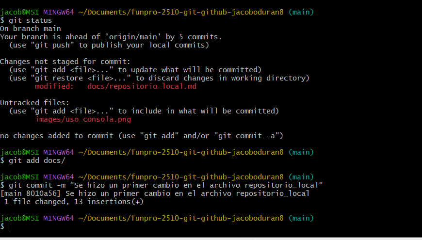

# Cómo crear un repositorio local con comandos git

Para crear un repositorio local se deben de usar comandos para configurar el usario por primera vez. Para que los cambios que uno haga queden registrados con el nombre de usuario del que lo edito.

git config --global user.name "Tu Nombre"

git config --global user.email "tuemail@example.com"

Para crearlo, se debe de elegir primero donde se quiere crear el repositorio. Ya despues en la ubicación deseada se debe de usar el comando "git init" para inicializar el repositorio con Git.

Cuando se trabaja con un repositorio local, se utilizan como "git add" para pasar del local al stage y "git commmit -m" para pasar del stage al repositorio.

Para ver el estado del repositorio se usa "git status". Y este comando muestra que archivos estan listos para hacer commit o a que archivos todavia no se les está haciendo tracking.

Estos son unos de los comandos que se utilizan tanto para repositorio local como remoto. Sin embargo el comando que haria falta sería "git init", para inicializar el repositorio.