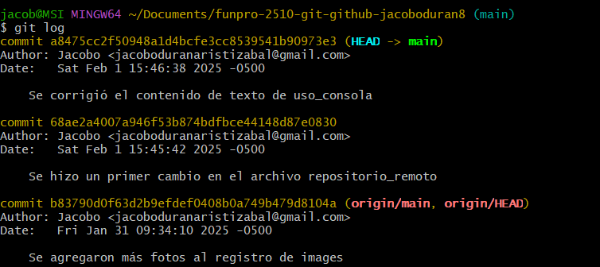

# Proceso para crear un repositorio remoto en GitHub

Para crear un repositorio en GitHub se debe de tener una cuenta. Allí debe de aparecer una opcion que diga "New Repository". Ingresando ahí aparecen varias opciones para configurar el repositorio. Como: nombre, descripcion, si es público o privado y otras opciones para que el repositorio ya tenga ciertos archivos como el "README.md" o ".gitignore".

Una vez el repositorio esta creado, mostrara una URL que servira para poder clonar este repositorio de manera local. Para eso se utiliza el comando "git clone URL del repositorio en GitHub". Una vez esté clonado el repositorio, y si trabaje de manera local, se debe de usar un comando llamado "git push" para que sincronice los commits y cambios hechos de manera local, a la nube.

Este es un ejemplo de cuando el repositorio local no esta igual que el repositorio remoto. Por el momento el local está más adelantado que el remoto. Lo que significa que al usar el comando "git push" el origin debe de estar igual que Head-main.